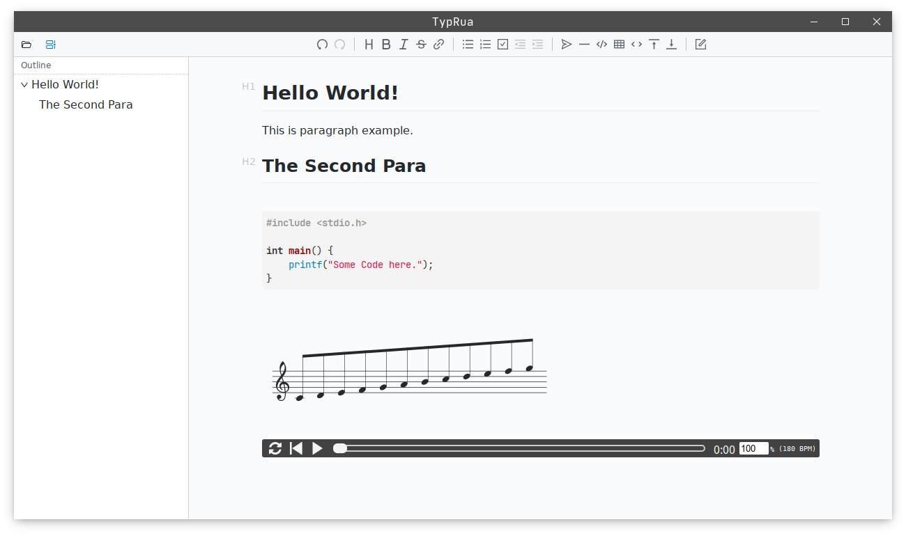

# 

Yet another MarkDown editor, open source!

## Development Status

this README.md is written in typrua :p

now it works:



thanks to [project vditor](https://github.com/Vanessa219/vditor)

### feature

- auto save
- drag-to-open support
- play music in editor using abc.js
- outline
- drag image to insert it into markdown document

### WIP

some important features are not implemented due to framework limits.

- copy image content and paste it
- insert file without `file:///` head
- markdown doc list in current folder
- export to PDF and other formats

## Development

### Build

```
$ git clone https://github.com/Reverier-Xu/typrua

$ mkdir -p build

$ cd build && cmake ..

$ make

$ bin/typrua
```

### Contributing

```
## under project root dir
$ git submodule sync
```

source code under `src/` is the qt part of this project, source code under `web/` is the editor based on web.

if you want to modify editor's source code, you can fork `https://github.com/Reverier-Xu/vditor` and change submodule repo to yours, when you are done, run `npm run build`, the result will automatically put into `src/resources/web`, then rebuild CMake project.

## LICENSE

Mozilla Public License Version 2.0.
